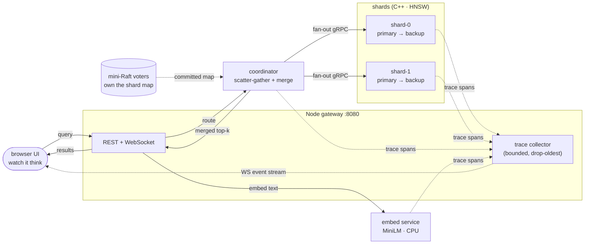
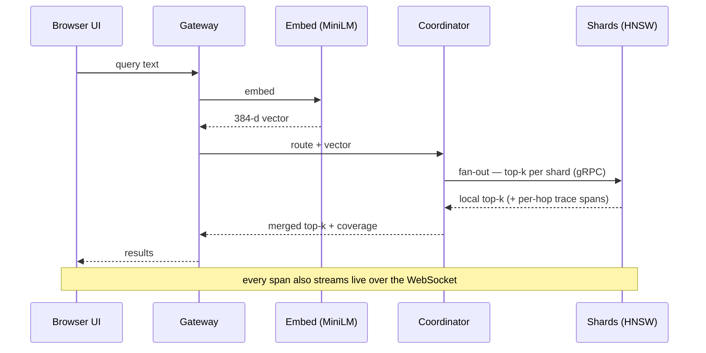

# Lucent

**A distributed vector search engine you can watch think.**

[](https://github.com/swarina/lucent/actions/workflows/ci.yml)
[](https://swarina.github.io/lucent/)
[](LICENSE)


Lucent is a self-hostable distributed semantic search engine whose defining feature is that its own internals are the interface. Documents are embedded locally (CPU-only sentence-transformers), sharded across processes with a hand-rolled HNSW index per shard, replicated with failover, and **every query's full journey — embedding → shard routing → per-shard ANN traversal → merge → failover events — renders live** in the frontend as the primary product surface.

## ▶ Live demo

**[swarina.github.io/lucent](https://swarina.github.io/lucent/)** — a real `all-MiniLM-L6-v2` session replayed entirely in the browser (no server, no cluster). Watch queries fan out across shards, open *"watch it think"* for the 3D HNSW traversal, and see a shard get killed and its backup take over.

Every inspector view is a **shareable permalink**: the URL carries the trace as `#/trace/{id}`, so you can link someone straight to a specific query's traversal. For live, interactive search — your own queries, real ranking, the chaos controls — [run it locally](#quickstart) or [with Docker](#run-with-docker).

<!-- ★ Best next addition: a screenshot or GIF of the "watch it think" view.
     Capture it from the live demo above (or a local run), save it under assets/,
     and reference it here, e.g.:   -->

## Status

**Milestones M0–M6 complete — shipped.** The full single-machine cluster runs end to end: local embeddings, hand-rolled HNSW per shard, scatter-gather with coverage-based partial results, primary-backup replication with automatic failover, a live 3D traversal inspector, a chaos surface (kill / restart / fault / node add-remove), semantic (k-means) partitioning with a recall/latency chart, and a from-scratch **mini-Raft** that owns the shard map (leader election, log replication, crash-safe persistence, a seeded 1,000-schedule invariant simulator). M6 ships the recorded **static demo** (above) and a **Docker image** (below) that runs the real live cluster in one command.

## What it demonstrates

1. **AI/ML** — local embeddings (`all-MiniLM-L6-v2`, 384-dim, CPU), hand-rolled HNSW approximate nearest-neighbor search per shard, seeded k-means semantic partitioning.
2. **Distributed systems** — sharding, primary-backup replication, a coordinator doing scatter-gather with coverage-based partial results, failure detection and failover, node add/remove, and a mini-Raft that owns the shard map through consensus.
3. **Visualization** — a live "watch it think" view: query fan-out, per-shard HNSW traversal in 3D, merge, replication lag, injected failure/recovery, and live Raft elections, all driven by real trace events.

## Architecture



Every process is a real OS process speaking gRPC (`proto/` is the single source of truth across C++, Python, and TypeScript). The **query path** and the **observability path** are deliberately separate: search never blocks on trace publishing, and trace publishing never backpressures search.

### A query's lifecycle



## Design principles

*(Hard rules — violating one is a bug, not a style choice.)*

- **Zero recurring cost.** No paid APIs, no cloud. Embeddings run on local CPU; the "cluster" is N processes on one machine.
- **Deterministic by construction.** Seeded everything, single-threaded index builds, sorted neighbor lists at seal. CI byte-diffs the structural digest across two independent build+query rounds — casual nondeterminism fails the build.
- **Observability never touches the data path.** No allocation or I/O in the search loop; a bounded ring buffer drops oldest on overflow (with counters); event publishing never backpressures search.
- **Failures become coverage, not retries.** At most one query-path retry (epoch mismatch only). Partial results are first-class and labeled with which shards answered.
- **Immutable after seal.** An HNSW shard is built once and sealed — no concurrent insert-during-search. Rebuild to change the corpus.

## Quickstart

**Prerequisites** (macOS shown; Linux equivalents work):

```sh
brew install cmake ninja node uv
git submodule update --init            # vcpkg (C++ deps)
```

**1. Build all three runtimes** — C++ engine, Node gateway, web UI:

```sh
cmake --preset dev && cmake --build --preset dev     # embed/coordinator/shard binaries
(cd gateway && npm install && npm run build)         # collector + REST/WS gateway
(cd web && npm install && npm run build)             # the UI the gateway serves
```

**2. Start a 2-shard cluster.** `--fake-embed` uses a deterministic hash encoder (instant, no model download) so you can see the machinery immediately — the whole pipeline is real, but result *ranking* isn't semantically meaningful (the UI says so):

```sh
uv --project py run lucent dev --shards 2 --fake-embed
```

**3. Ingest the bundled 2k-doc test corpus** (in a second terminal). The supervisor wrote the effective config to `.lucent/cluster-dev.yaml`:

```sh
uv --project py run lucent ingest --config .lucent/cluster-dev.yaml --corpus testdata/corpus-2k.jsonl --n 2000
```

**4. Open the UI** at **http://localhost:8080** — type a query, watch the fan-out and span waterfall, click *"watch it think"* for the 3D HNSW traversal, and open the **cluster** panel to kill a shard and watch coverage degrade (or, with `--replicas 2`, watch a backup get promoted).

### Real semantic search

The fake encoder is for fast iteration and CI. For meaningful results, install the model and drop `--fake-embed` (first run downloads ~90 MB of `all-MiniLM-L6-v2`):

```sh
(cd py && uv sync --extra embed)
uv --project py run lucent dev --shards 2            # real MiniLM
```

To search a larger real corpus, `uv --project py run lucent corpus fetch` pulls the arXiv abstracts dump, then `lucent ingest` without `--corpus` samples from it.

## Run with Docker

A single image runs the whole real-model cluster (the supervisor manages the processes inside the container). It's built and smoke-tested in CI and published to GHCR:

```sh
docker run -d --name lucent --restart unless-stopped \
  -p 80:8080 -e LUCENT_FAKE_EMBED=0 -v lucent-data:/app/data \
  ghcr.io/swarina/lucent:latest
docker logs -f lucent          # model download → ingest → "ingest complete"
# then open http://localhost/
```

Or build locally with the bundled corpus baked in:

```sh
docker compose --profile demo up --build
```

See [deploy/README.md](deploy/README.md) for a full 24/7 deploy runbook (e.g. an Oracle Cloud Always-Free ARM VM) and public-endpoint guardrails.

### Record your own demo

`lucent record` tees a live cluster into a replay bundle (events, results, decoded traces, projections) that the frontend plays back with no backend — exactly what the hosted demo runs on:

```sh
uv --project py run lucent record --out web/public/bundle
```

## Testing & CI

Correctness is enforced by gates, not vibes. Six CI jobs (`.github/workflows/ci.yml`) cover **83 C++** (`ctest`) and **46 Python** (`pytest`) tests plus gateway/web `vitest`, an **ASan/UBSan** build, and a proto parse check. The integration job runs behavioral gates against a live cluster:

- **Recall gate** — `lucent bench` asserts HNSW recall vs. a brute-force oracle across `ef` × `probe` sweeps.
- **Determinism gate** — two independent ingest→build→query rounds produce **byte-identical** structural digests (xxh3 over per-shard traversal + merged results); timestamps/trace-ids excluded by design.
- **Failover suite** — a query storm while a shard is killed and recovered, asserting coverage degrades and repairs correctly.
- **Overhead gate** — tracing adds a bounded, measured overhead and never sits on the search loop.

## Repository layout

```
cpp/        C++20 engine — shard, coordinator, HNSW index, mini-Raft (vcpkg + CMake)
py/         Python (uv) — embed service, ingest, bench, recorder, `lucent` dev supervisor/CLI
gateway/    Node/TS — REST + WebSocket gateway and trace collector
web/        React + react-three-fiber — the "watch it think" UI (3D inspector, replay)
proto/      gRPC/protobuf — the single source of truth for all three languages
deploy/     Dockerfile inputs, entrypoint, and the deploy runbook
testdata/   bundled 2k-doc arXiv corpus + golden-trace fixtures
```

## Limitations (by design, and honestly)

This is a learning-first portfolio project under a hard zero-cost constraint, not a production datastore. The interesting engineering is real; the scope is deliberately bounded:

- **Single-host "cluster."** N processes on one machine. Real network partitions, cross-host clock skew, and NIC failures aren't modeled; inter-node latency is loopback. Chaos is injected in-process or via the supervisor.
- **The coordinator is a single query router.** With `--raft`, three voters own the *shard map* — so membership and failover commit through consensus and survive a coordinator restart — but the process routing each query is still a single point on the query path.
- **The index is immutable after build.** No online inserts, updates, or deletes; changing the corpus means a rebuild. This buys determinism and is a conscious trade.
- **Single-host clocks.** Span timings come from one machine's monotonic clock; cross-node ordering is meaningful only because it *is* one clock — not distributed clock synchronization.
- **Traces are tiered, not total.** Only UI-initiated FULL queries capture per-hop HNSW blobs; background and rate-capped queries degrade their *trace*, never their *search*.
- **`--fake-embed` ranks by a hash, not meaning.** It exercises the entire pipeline deterministically for CI and instant demos; for semantic ranking, use the real MiniLM model.

## Data

The bundled `testdata/corpus-2k.jsonl` and the optional larger corpus are [arXiv](https://arxiv.org/) paper metadata (titles + abstracts), used here purely as a search corpus. Thanks to arXiv for use of its open metadata; Lucent is not affiliated with or endorsed by arXiv.

## License

[MIT](LICENSE) © 2026 Swarina Jaiswal
